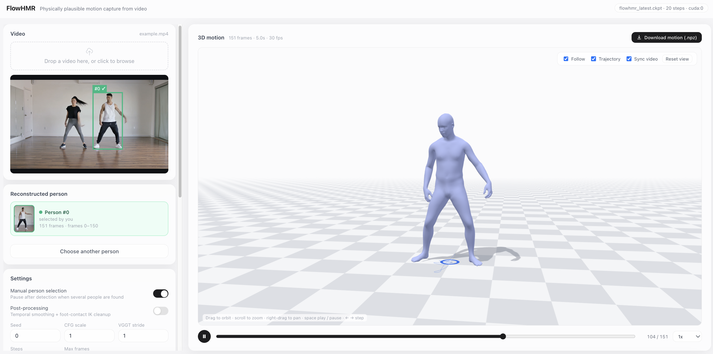

# Web Demo

Copy this into your coding agent:

```text
Launch the FlowHMR Web demo in my checkout. Follow docs/install.md for the V2M
setup and docs/web_demo.md for launch and verification.
Check the required model files, select an available GPU and port, then start
app.py. Use assets/example/example.mp4 to verify motion generation and playback.
Read docs/params.md if settings need adjustment. Report the demo URL, logs,
and saved result path, or explain any remaining blockers.
```

## What the demo does

Upload a video to run person detection and tracking → VGGT-Omega camera
estimation → SAM-3D-Body features → FlowHMR motion generation. The page shows
the reconstructed SMPL-H motion in a 3D viewer beside the input video.

<p align="center">
  
</p>

- **Settings per run**: seed, CFG scale, ODE steps, max frames, VGGT stride and
  post-processing are set in the page's Settings card for each upload.
- **Person selection**: when more than one person is detected and *Manual person
  selection* is on, the job pauses after detection. Pick the target person from the
  list (each entry shows a crop of that person) or click their box in the video
  preview, then confirm. Without a choice within 10 minutes, the suggested person
  (longest / largest track) is used. With the switch off, it is chosen automatically.
- **Re-run**: a finished run can be re-run from *Recent runs* with the current
  settings; detections, camera and features are reused, so only generation runs again.
- Run history is kept in memory and is cleared when the server restarts; results
  stay in `output/web_jobs/`.

This is the **self-hosted** demo. The hosted Hugging Face demo is listed separately
in the [release plan](../README.md#release-plan).

## Launch

Complete the V2M setup in [install.md](install.md), including the perception
submodules and checkpoints. Run commands from the **repository root**:

```bash
conda activate flowhmr
python app.py
```

The default checkpoint is `checkpoints/flowhmr_latest/flowhmr_latest.ckpt`.
After the log prints `FlowHMR web demo ready`, open `http://localhost:8080`
on the same machine, or `http://<host>:8080` when connecting remotely.
The page queues jobs on the selected GPU.

## Verify a run

1. Upload `assets/example/example.mp4`.
2. Wait for detection, camera estimation, feature extraction, and generation.
3. Check that the input video and reconstructed motion both play in the page.
4. Find the exported motion at `output/web_jobs/<job_id>/motion.npz` by default.

## Adjust settings

All run settings are in the page's Settings card; see [params.md](params.md#web-demo).
For long videos or limited GPU memory, increase **VGGT stride** (e.g. `10` or `30`)
so camera estimation processes fewer frames and interpolates in between.

See [camera settings](params.md#camera-settings) for the tradeoff and other
camera reconstruction approaches. Missing model files are listed at startup;
use [resources.md](resources.md) to locate them and [install.md](install.md)
to prepare them.
